# Setting Up Homelab In Azure

**This is a thread of me setting up my virtual homelab i Azure to practice Sysadmin tasks.**  

---
---
---
### Setting up VMs
**Here, I am setting up the server VM using Windows Server 2022. It says I used US East region for my VMs, but I went back later to create the VMs over due to errors that I didn't get to document. You will see in later pictuers.**  
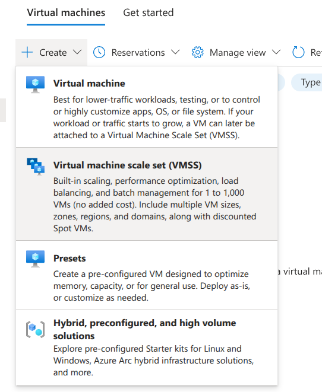
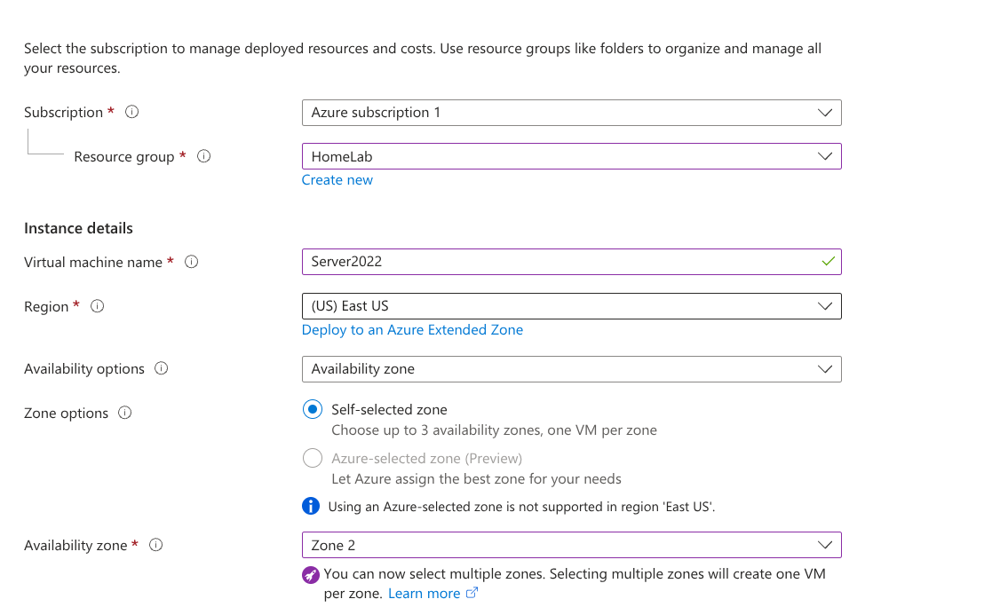
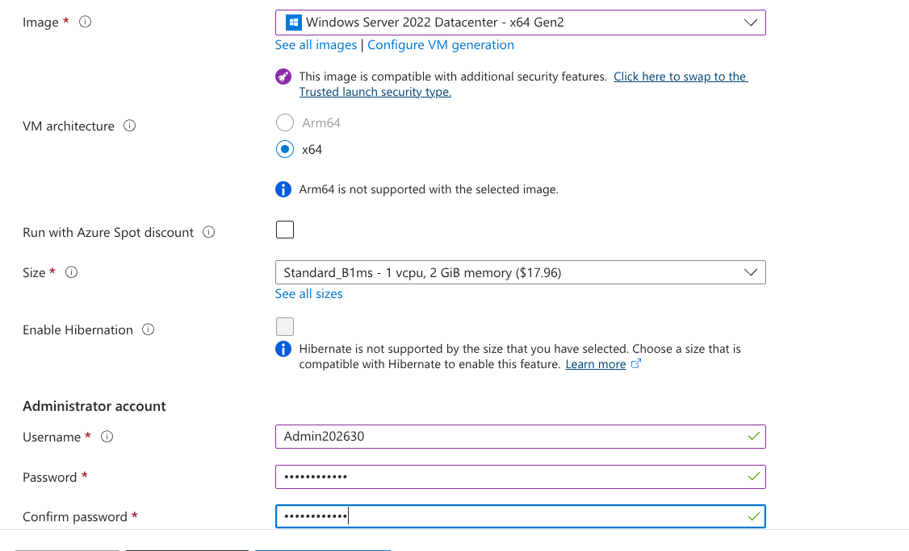   

---
---
---

## VM is deploying  
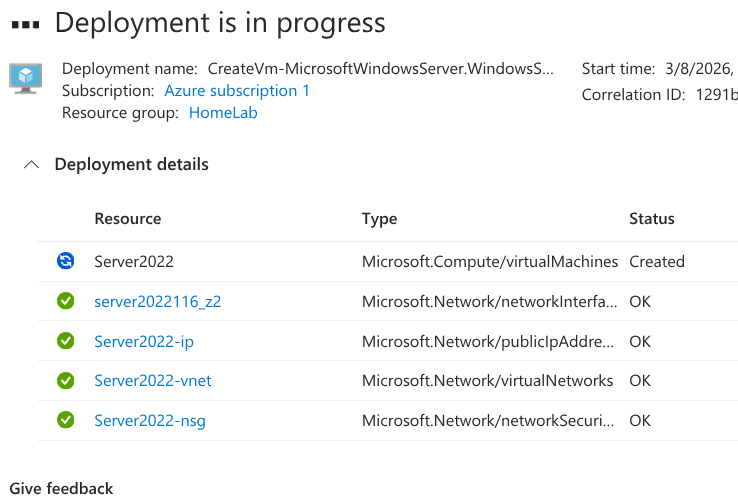   

---
---
---

**This is where I created the VM for the client computer using Windows 11 Enterprise. I used zone 2, and I couldn't figure out what it did, but it wouldn't allow to use Zone 1 for the Windows Server VM and in order to connect both VMs to the same vnet it was necessary to add both to the same region and zone.**  
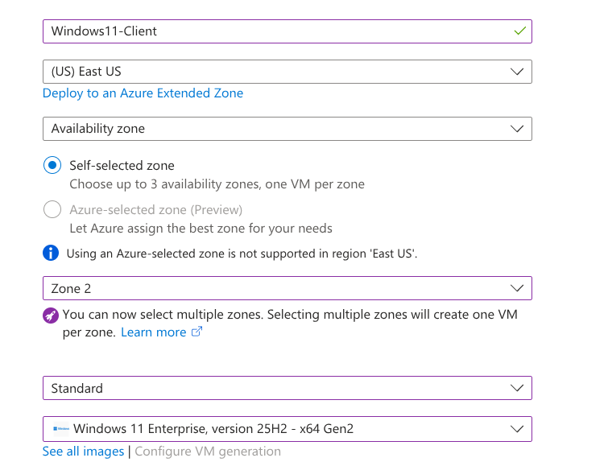   

---
---
---

### VMs are finished
**As you can see the location says West US 2. I was having issues with the last VMs I created in East US and there was an outage in East US (I hear that outages are common in East US 1).**   
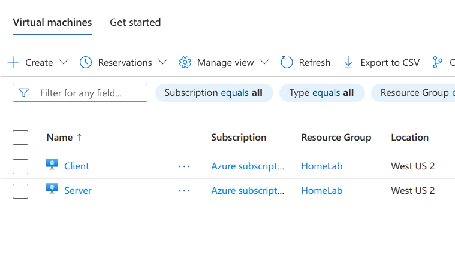   

---
---
---

### Resizing virtual machines
**I resized my VMs for more speed and better ease of use. I was using B1s, which only had 2gb of RAM, and I switched to B2s with 4gb RAM and 2 CPU. It was much faster and made setting up my server much easier.**  
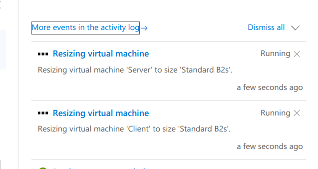   

---
---
---

### Setting up server  
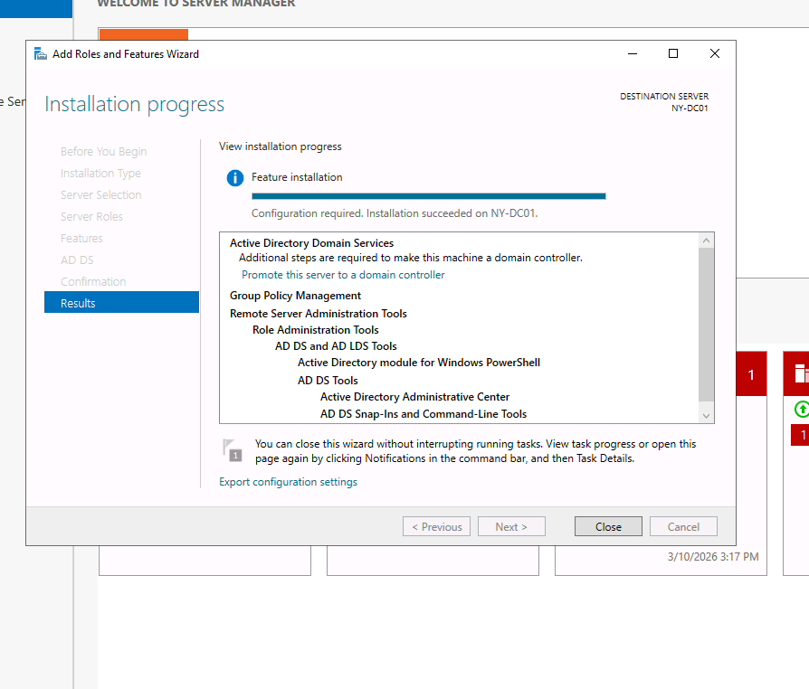
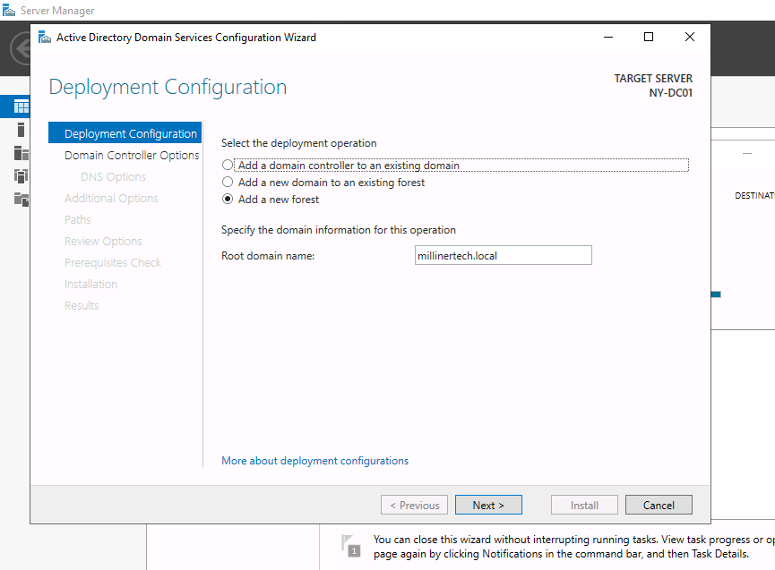
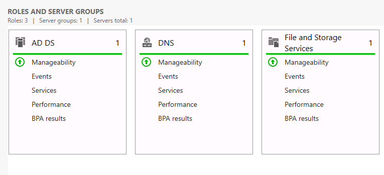   

---
---
---

### Creating users  

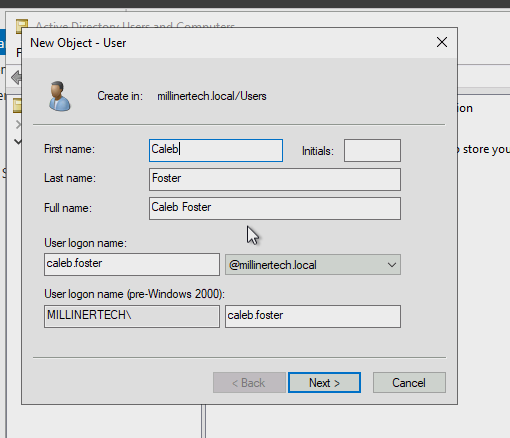
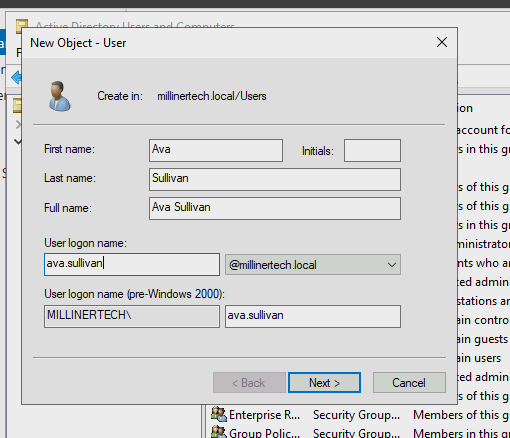
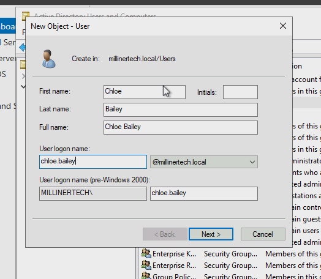   

---
---
---

### Connecting Client to Server
**Making sure client computer can reach server and connecting client to the server**  
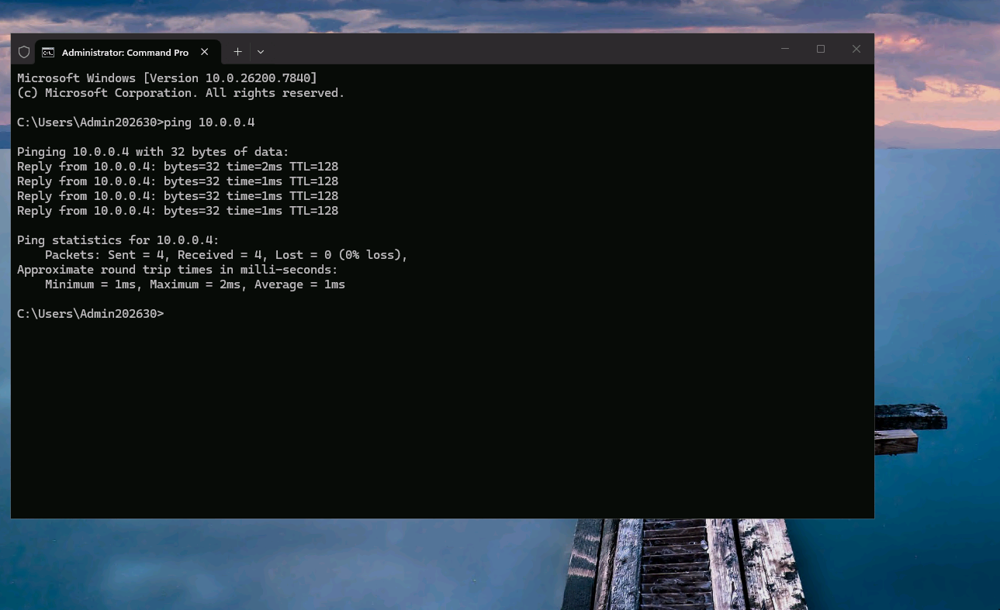
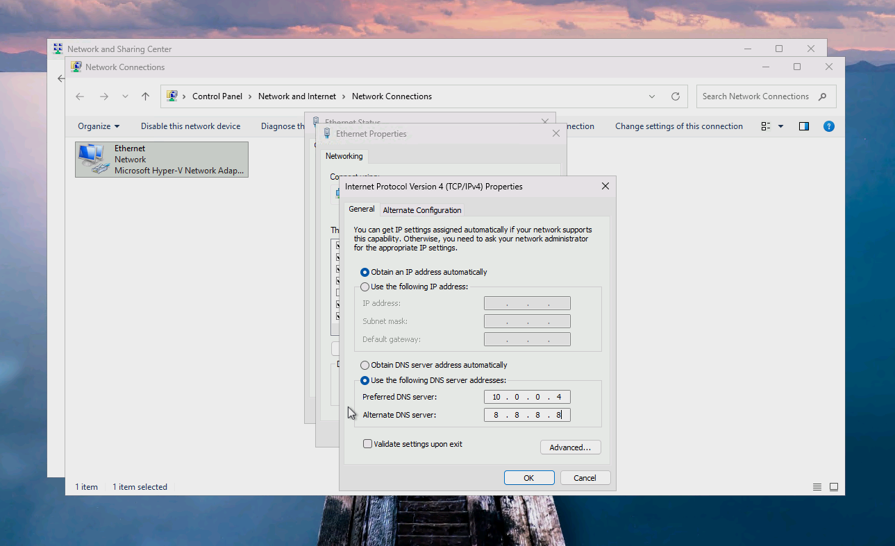
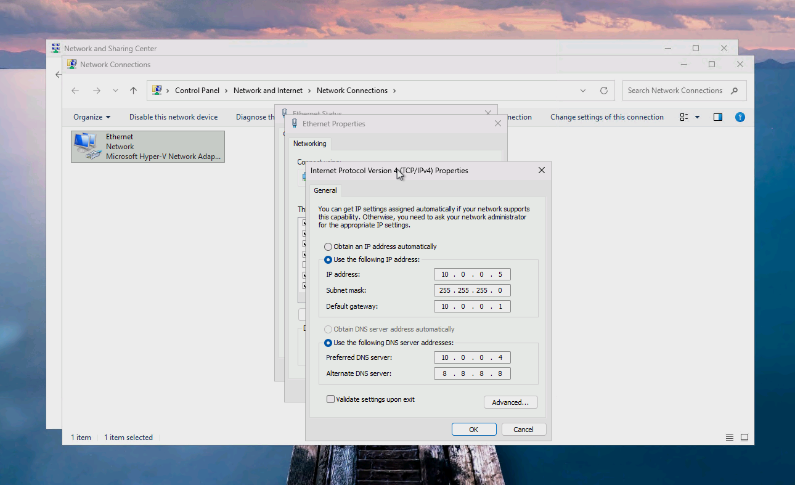
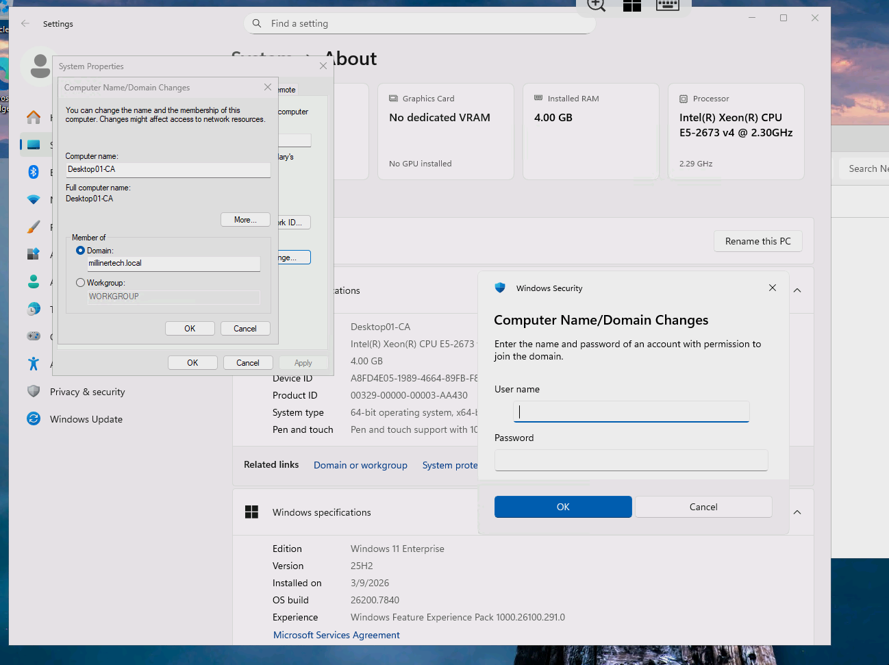
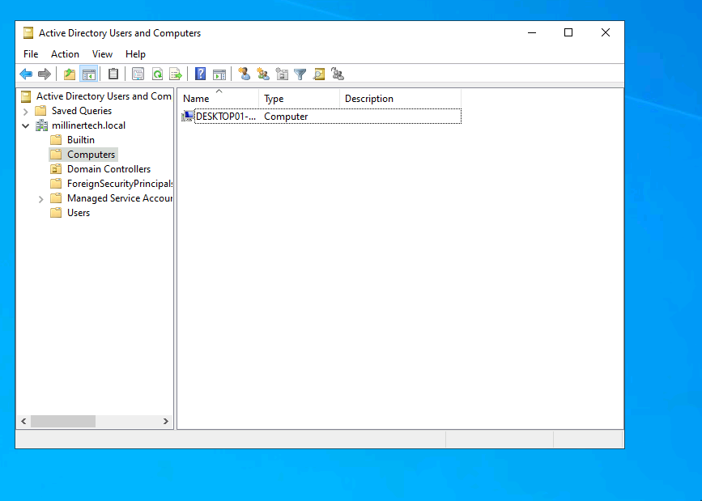   

---
---
---

### Trying different group policies  
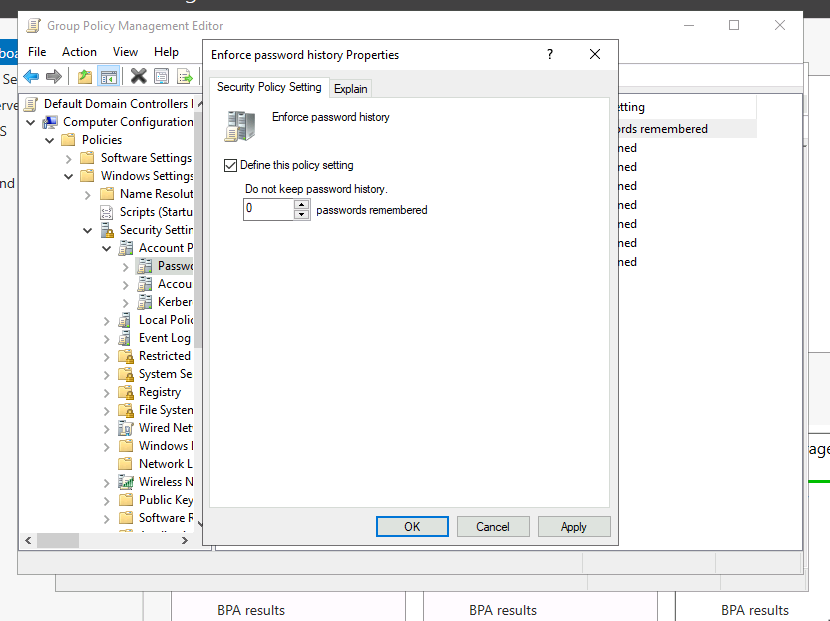
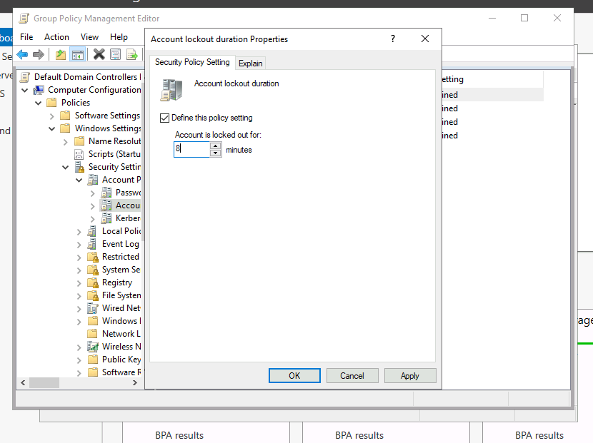
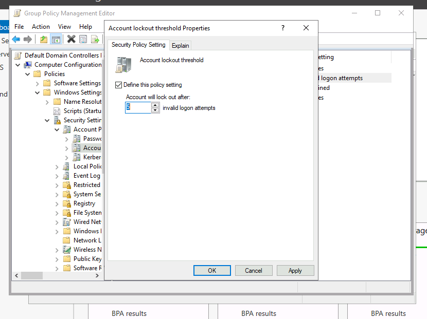
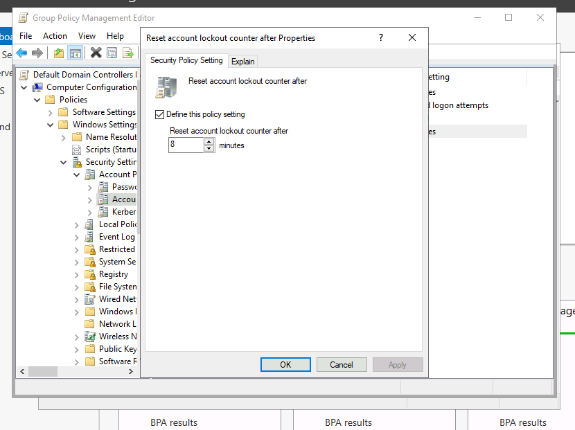   
